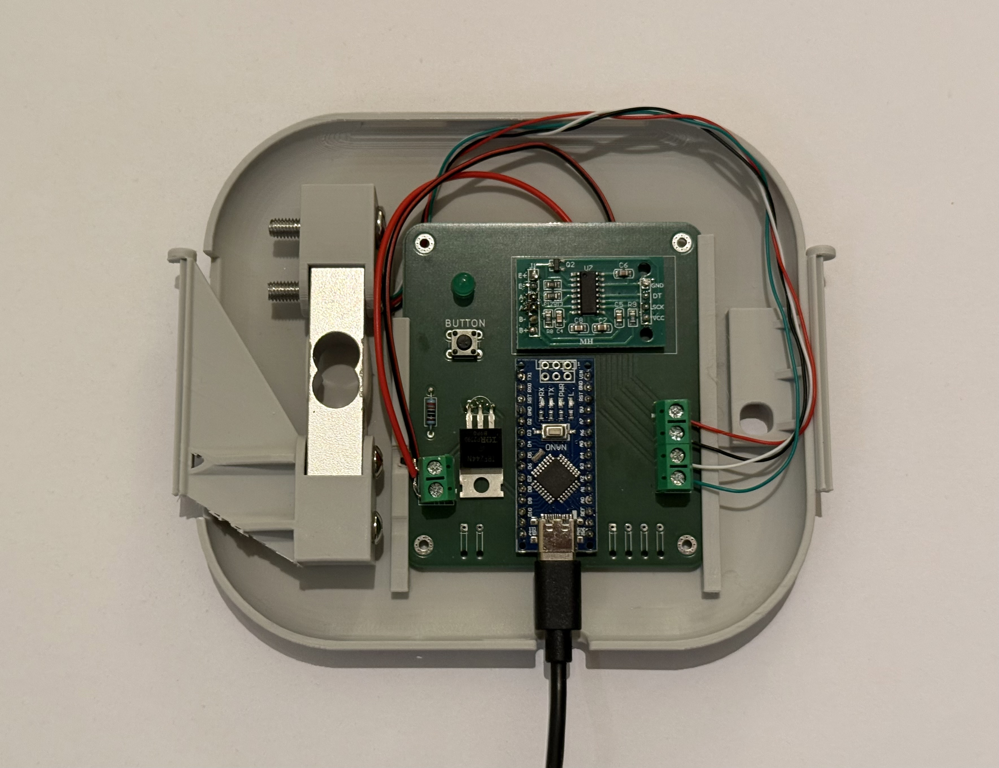

# HapticBreathe
HapticBreathe is a wearable haptic feedback device for people living with Empty Nose Syndrome (ENS). It measures chest expansion via a load cell connected to an elastic chest strap and delivers vibrotactile feedback through a vibration motor mounted on the body-facing side of the device based on feedback algorithms.

## About This Repository
This repository accompanies the research paper and contains:
- **3D models** — STL files for the housing and strap attachments
- **Gerber files** — PCB manufacturing files
- **Microcontroller firmware** — Arduino source code

To build the device, the following components are required:

| Component | Description |
|---|---|
| Arduino Nano compatible microcontroller board | e.g. 5V/16MHz, CH-340G chip |
| Load cell | 12.7 × 12.7 × 80 mm, 5 kg |
| ADC module | HX711, 24-bit analog-to-digital converter for load cells |
| Flat coin vibration motor | 10 × 2.7 mm, DC 3V |
|  Transistor | MOSFET, IRFZ44N, N-channel, 49A/55V |
| LED (green) | 5mm round dome, through-hole |
| Resistor | LED current-limiting resistor, 220Ω |
| Tactile push button | 6×6mm, 4-pin through-hole, 50mA/12VDC |
| Screw terminal | 2-pin × 3 |
| Elastic webbing straps with Velcro fasteners | For the chest and shoulder straps  |
| Custom PCB | Gerber files included in this repository |
| 3D printed housing | Printed from the STL files included in this repository |

The components are mounted as shown in the image above.